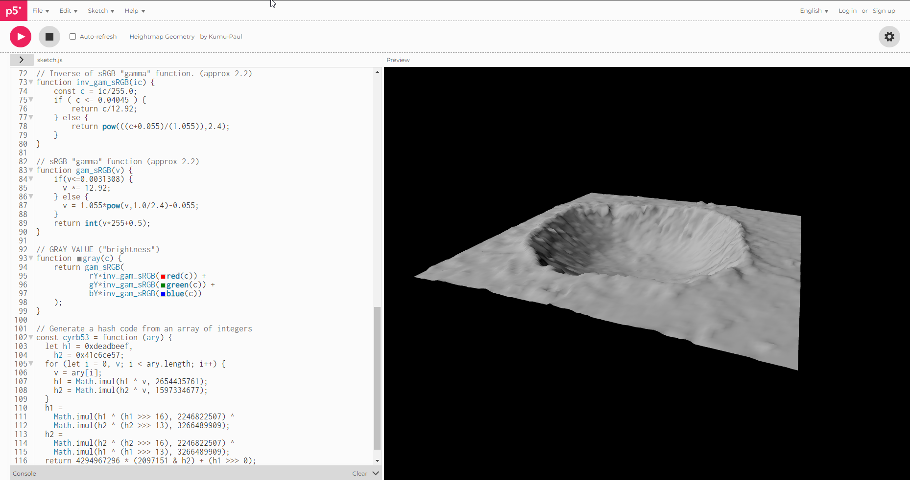
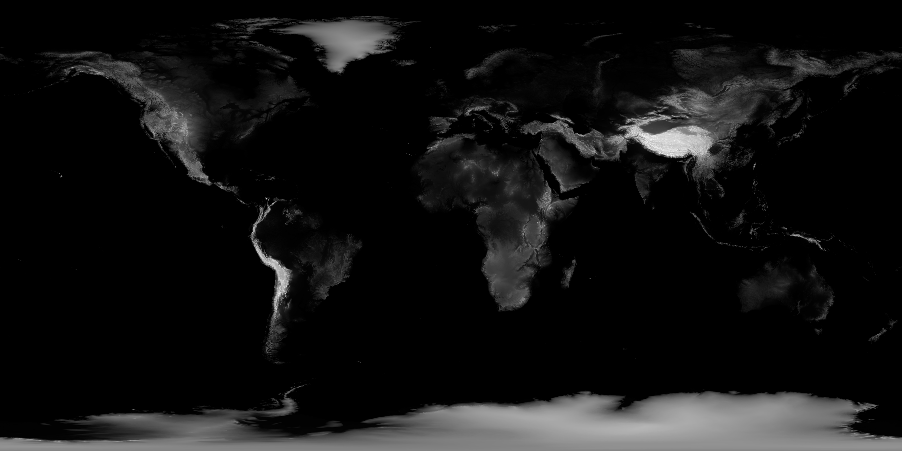
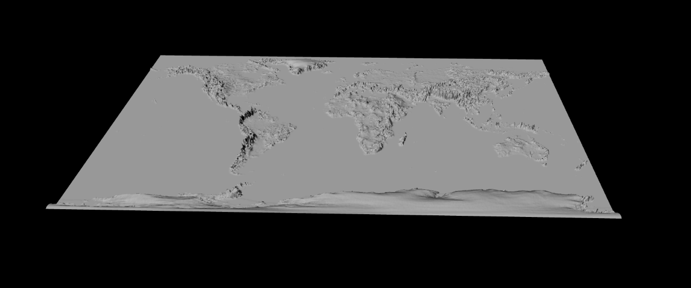

# Final Product

## Descision on what I should make

### 3D programming
First I tried to make a better 3D Model of the Globe, that I used for the [Clock](../day03/01/index.html) with Bumpmapping, which took much time to search for a good referencepoint. I found a source by [Kumu-Paul](https://editor.p5js.org/Kumu-Paul/sketches/W3YM4J-eW), that uses a grayscale image into a 3D Mesh.

Hereby I used the following Image as the heightmap:

And turned that into a mesh, which turned out pretty well, I just had to adjust some parameters, to make it look more believable:

I tried to apply the earth color texture, but unfortunaly it didn't display the whole image, but instead showed a little portion of it. 

Unfortunately I didn't found any solutions to that, but this is a challange, I still want tackle in the future.

### Face
Here I tried to make more out of that face