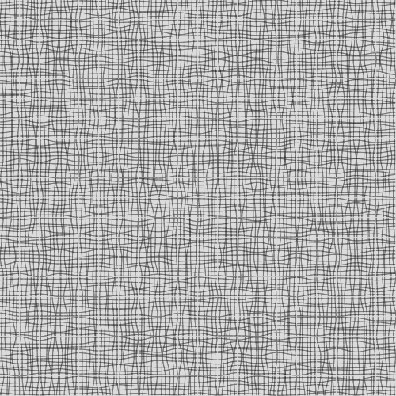
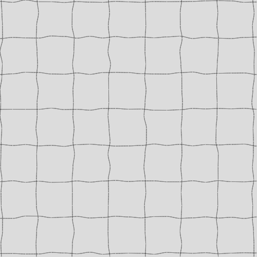
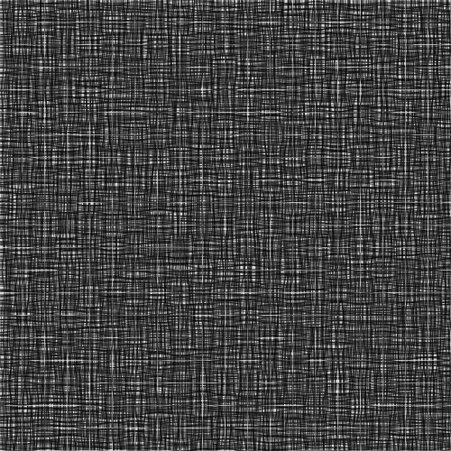
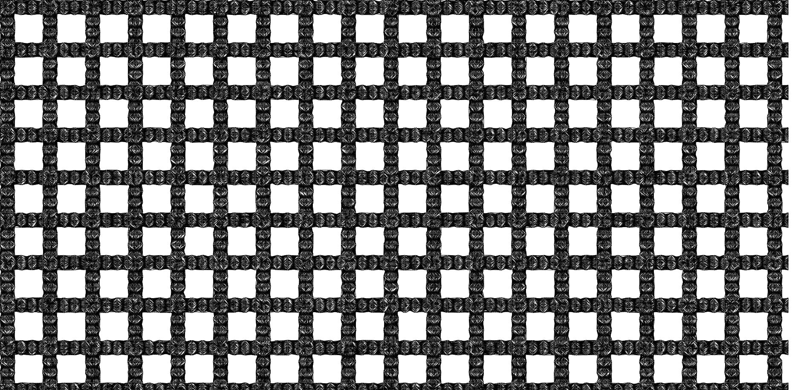

# **Day 2 - 06.09.2022**
Today we tried make a computergraphics based on grids and patterns. I tried to make a grid with imperfect lines. The intention here was to make it look like as it was handmade. I achieved the grid with [Linear Interpolation](https://en.wikipedia.org/wiki/Linear_interpolation).

For this, I had already my own LERP algorithmn, which draws lines with points. 

<iframe src="02/index.html" width="100%" height="500px"></iframe> 

---

I modified it to make the lines less mountainous, but still imperfect, like continous lines that are drawn with an human hand. For that, I used the following LERP function.
```javascript
// This function is used, to make the Lines less straight and more wavey.
function myCosLerp(t, y0, y1) {
  return (0.5 * (1 - cos(t * PI))) * (y1 - y0) + y0;
}
```

<iframe src="01/index.html" width="100%" height="500px"></iframe> 

I was able to make some very interesting patterns. I can make patterns with variable densities.

**These were made near the end of the course**






That one looks almost like Jeans textile.


This pattern also reminded me of some kind of Textile


This looks like a grid made out of ropes



