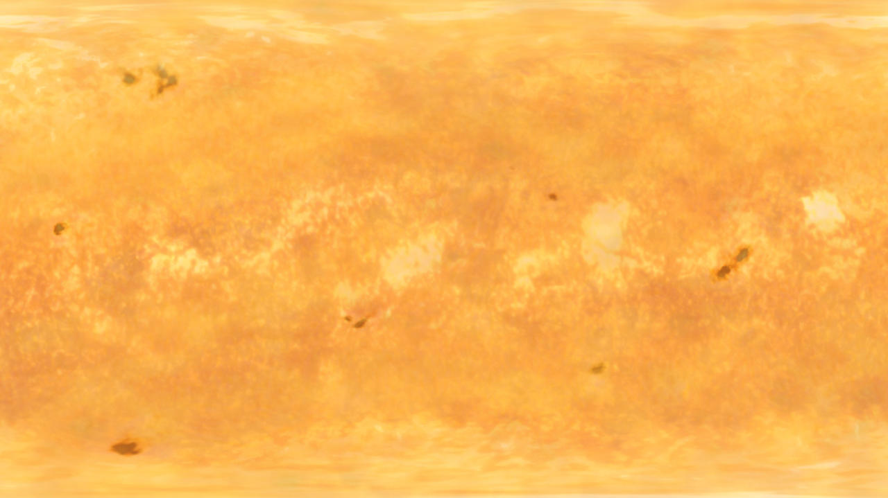
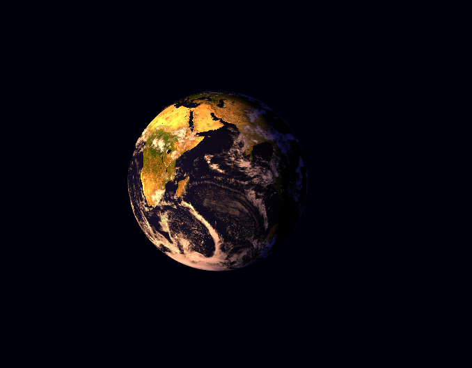
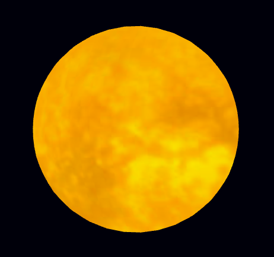

# **Day 3 - 07.09.2022**

Today we had the task to do an unique clock, that should involve some kind of cycle. My idea was to make a globe rotate periodically, in which the time could be told based on it's rotational angle. The Idea was inspired by [**Blender Guru**](https://www.youtube.com/watch?v=0YZzHn0iz8U)

To make the globe more earthlike, I applied a [texture](https://www.dropbox.com/sh/1rxblwi19i78ieh/AADNsHNRA7SysJ015GkXplewa?dl=0), which was provided by NASA. At first I applied the earth texture on a sphere and after that I tried to make it reflect light, by letting it emit it from another sphere, that should represent the sun. to make it more realistic, I applied a cloud texture ontop the earth texture. Applying the texture on a 3D modell is surprisingly easy in P5.js. it goes like this:

```javascript
let img1;

function preload() {
    img1 = loadImage('image.png'); //first you preload the image.
}

function setup() {
    createCanvas(windowWidth, windowHeight, WEBGL);
    noStroke();
}


function draw() {
	backround(255);
	texture(img1); // Here you call the preloaded image as a texture BEFORE the mesh is created.
    sphere(100, 100, 100)
}

```

**The textures I used for the earth:**

ad


This following texture is used for the Sun


I tried to make a Sun, that emits light by adding an emissive material, that reflects on the spinning globe, but I had to do some workarounds, because it turns out that the emitting color doesnt reflect on the surface.

This is the earth, that reflects the light with the `directionalLight()` function on it.


This is the sun, that should emit the light, but doesn't really.


Here is an interactive version.

<iframe src="01/index.html" width="100%" height="500px"></iframe>
